[](https://github.com/abocaugustin-dotcom)

<!--
**abocaugustin-dotcom/abocaugustin-dotcom** is a ✨ _special_ ✨ repository because its `README.md` (this file) appears on your GitHub profile.

Here are some ideas to get you started:

- 🔭 I’m currently working on ...
- 🌱 I’m currently learning ...
- 👯 I’m looking to collaborate on ...
- 🤔 I’m looking for help with ...
- 💬 Ask me about ...
- 📫 How to reach me: ...
- 😄 Pronouns: ...
- ⚡ Fun fact: ...
-->
## 🎓 About Me

```python
class Student:
    def __init__(self):
        self.name = "Augustin Aboc"
        self.role = "College Student"
        self.location = "Cabadbaran City/Philippines"
        self.education = "Information Technology"
        self.languages = ["HTML", "CSS", "JavaScript", "Python", "Java", "Dart"]
        self.currently_learning = ["Web Development", "Mobile Apps"]
        self.hobbies = ["Coding", "Gaming", "Music", "Reading", "Watching Videos"]

me = Student()
me.say_hi()
```
- 📫 Reach me at: abocaugustin@gmail.com

### Skills

    


#### Connect with me

   

##### My Github Stats 


### ▢ GitHub Streak


</td>
</tr>
</table>

<div align="center">

### ▢ Contributions


</div>

<br clear="both">

###

<picture>
  <source media="(prefers-color-scheme: dark)" srcset="https://raw.githubusercontent.com/abocaugustin-dotcom/abocaugustin-dotcom/output/pacman-contribution-graph-dark.svg">
  <source media="(prefers-color-scheme: light)" srcset="https://raw.githubusercontent.com/abocaugustin-dotcom/abocaugustin-dotcom/output/pacman-contribution-graph.svg">

</picture>

###

## 🚀 Current Project: Bird Class Identifier(Flutter App)

<p align="justify">
This application is designed to identify and classify different <strong>Bird Species</strong> using images. The main goal of the app is to help users easily recognize birds through a simple and user-friendly mobile interface built with Flutter.
<br/><br/>
The app can identify ten classes of birds, which include Crow, Eagle, Hummingbird, Owl, Parrot, Peacock, Penguin, Pigeon, Sparrow, and Swan. When a user selects or uploads an image of a bird, the application analyzes it and displays the bird’s class along with basic information.
</p>

---

### 🧬 Bird Classes Overview

Below is a quick overview of the mushroom classes that Fungi Scan can recognize, with a short description and a sample image for each class.

<table>
  <tr>
    <th align="left">Class Name</th>
    <th align="left">Description</th>
    <th align="center">Sample Image</th>
  </tr>
  <tr>
    <td><strong>Crow</strong></td>
    <td>Intelligent black birds known for their problem-solving abilities and distinctive cawing sound.</td>
    <td align="center">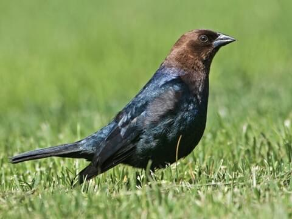</td>
  </tr>
  <tr>
    <td><strong>Eagle</strong></td>
    <td>Description
Powerful birds of prey with excellent vision, symbolizing strength and freedom.</td>
    <td align="center"></td>
  </tr>
  <tr>
    <td><strong>Hummingbird</strong></td>
    <td>Tiny birds capable of hovering in flight, known for their rapid wing beats and iridescent colors.</td>
    <td align="center">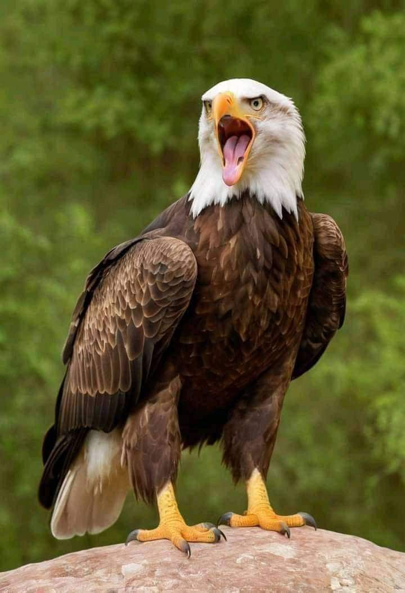</td>
  </tr>
  <tr>
    <td><strong>Owl</strong></td>
    <td>Nocturnal birds of prey with large eyes and the ability to rotate their heads significantly.</td>
    <td align="center"></td>
  </tr>
  <tr>
    <td><strong>Parrot</strong></td>
    <td>Colorful tropical birds known for their intelligence and ability to mimic human speech.</td>
    <td align="center"></td>
  </tr>
  <tr>
    <td><strong>Peacock</strong></td>
    <td>Large pheasants known for the male's spectacular tail feathers used in courtship displays.</td>
    <td align="center">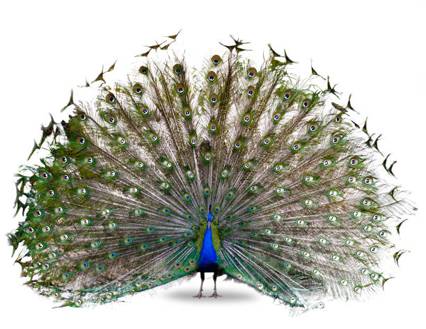</td>
  </tr>
  <tr>
    <td><strong>Penguin</strong></td>
    <td>Flightless aquatic birds adapted for life in the water, known for their distinctive waddle.</td>
    <td align="center">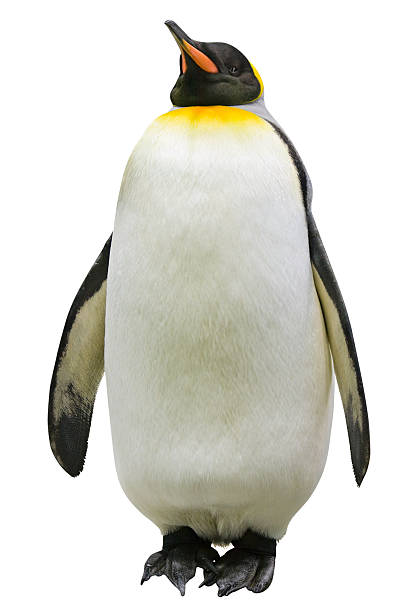</td>
  </tr>
  <tr>
    <td><strong>Pigeon</strong></td>
    <td>Common urban birds found worldwide, known for their homing abilities and cooing sounds.</td>
    <td align="center">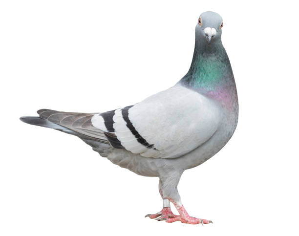</td>
  </tr>
  <tr>
    <td><strong>Sparrow</strong></td>
    <td>Small, plump brown birds commonly found in urban and rural areas worldwide.</td>
    <td align="center">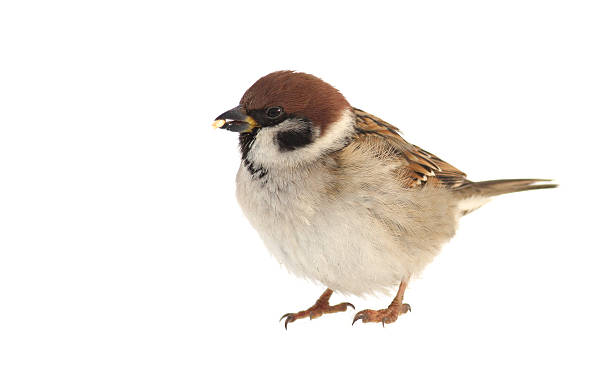</td>
  </tr>
  <tr>
    <td><strong>Swan</strong></td>
    <td>Elegant waterfowl known for their long necks and graceful swimming, symbolizing beauty and grace.</td>
    <td align="center"></td>
  </tr>
</table>

---

### 🏠 Home Page & 📖 Bird Description

<table>
  <tr>
    <td align="center">
      <strong>Home Page</strong><br/>
      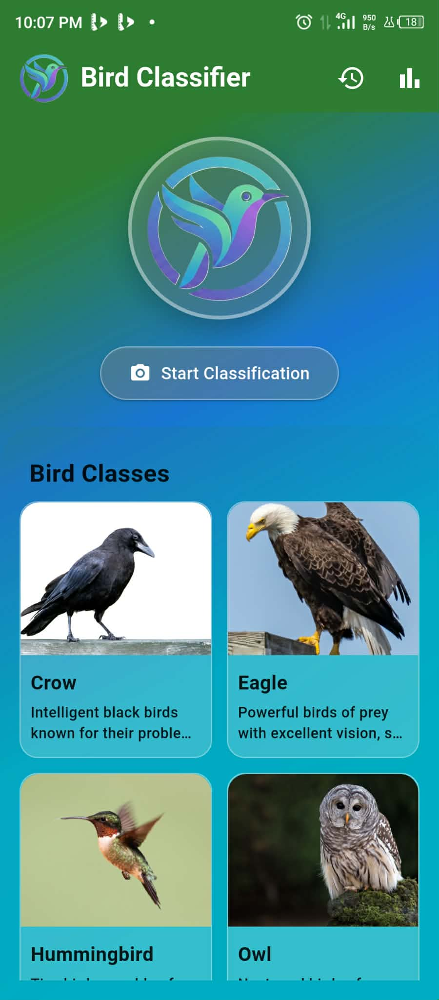<br/>
      <sub></sub>
    </td>
    <td align="center">
      <strong>Bird Description</strong><br/>
      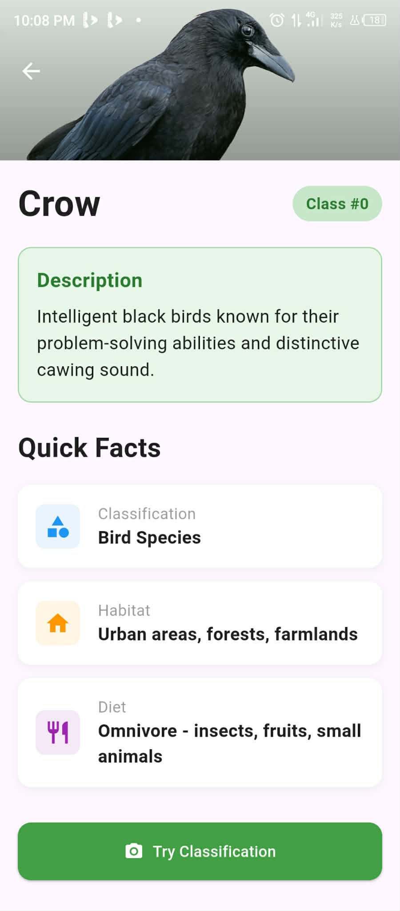<br/>
      <sub></sub>
    </td>
      <td align="center">
      <strong>Bird Description</strong><br/>
      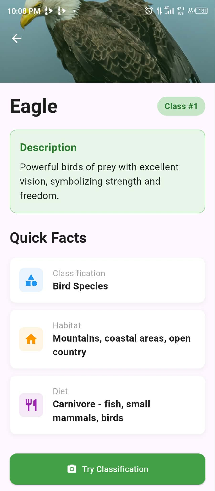<br/>
      <sub></sub>
    </td>
      <td align="center">
      <strong>Bird Description</strong><br/>
      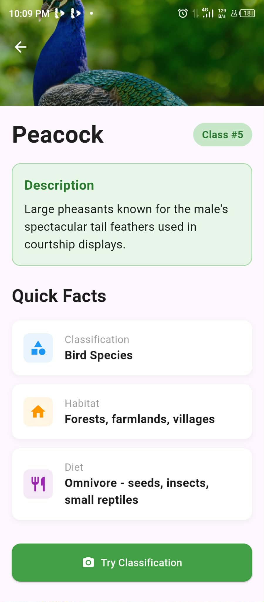<br/>
      <sub></sub>
    </td>
  </tr>
</table>

---

### 🍄 Supported Fungi Classes

Below are sample screens showing the fungi that Fungi Scan can classify:

<p align="center">
  
  
  
  
  
</p>

<p align="center">
  
  
  
  
  
</p>


### 📷 Capture or Upload Images & ✅ Scan Result

<table>
  <tr>
    <td align="center">
      <strong>Capture or Upload Images</strong><br/>
      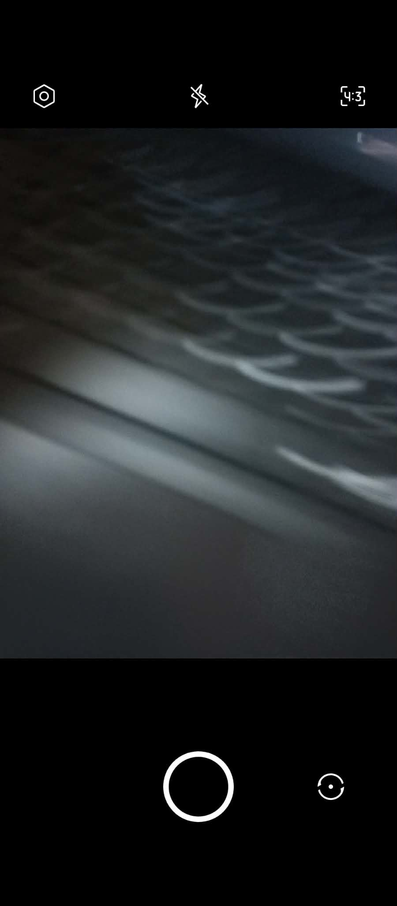
      <br/>
      <sub>Users can either take a new photo using the camera or upload an existing image from their device. These images are then sent to the model for fungi classification.</sub>
    </td>
    <td align="center">
      <strong>Scan Result</strong><br/>
      <br/>
      <sub>After a scan, the Result screen shows the predicted fungi class along with confidence percentages, so users can see how likely each class is.</sub>
    </td>
  </tr>
</table>


